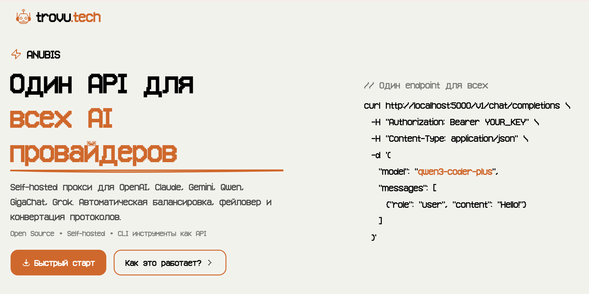

# ANUBIS AI Proxy

<div align="center">
  
  
  **Self-hosted прокси для работы с разными AI провайдерами через один API**
  
  <br>
  
  <a href="https://pay.cloudtips.ru/p/555c83ec">
    
  </a>
  
  <br>
  
  **ANUBIS бесплатен и всегда будет бесплатным**
</div>

---

## Содержание

- [Зачем это нужно?](#зачем-это-нужно)
- [Быстрый старт](#быстрый-старт)
- [Как это работает?](#как-это-работает)
- [CLI инструменты как API](#cli-инструменты-как-api)
- [Примеры использования](#примеры-использования)
- [Поддерживаемые провайдеры](#поддерживаемые-провайдеры)
- [Возможности](#возможности)
  - [Автоматическое управление токенами](#автоматическое-управление-токенами)
  - [Health checks](#health-checks)
  - [Retry механизм](#retry-механизм)
  - [Системный промпт](#системный-промпт)
  - [Fallback цепочки](#fallback-цепочки)
  - [Статистика](#статистика)
  - [Поддержка прокси](#поддержка-прокси)
- [Управление](#управление)
- [Безопасность](#безопасность)
- [Разработка](#разработка)
- [Лицензия](#лицензия)

---

## Зачем это нужно?

Представьте: у вас есть приложение, которое работает с AI. Сегодня вы используете Claude, завтра хотите попробовать Qwen, а послезавтра — GigaChat от Сбера. Обычно это означает переписывание кода, смену форматов запросов, новые библиотеки.

**ANUBIS решает эту проблему.** Один API для всех провайдеров. Меняете модель в запросе — система сама разберется куда идти и как конвертировать данные.

### Что умеет ANUBIS?

**Работает с любыми провайдерами**  
OpenAI, Claude, Gemini, Qwen, GigaChat, Grok — добавляйте сколько угодно аккаунтов. Система сама выберет здоровый и распределит нагрузку.

**Превращает CLI инструменты в API**  
У вас есть доступ к AI через `gcloud` или `aws-cli`? ANUBIS превратит его в обычный REST API. Триал аккаунты, корпоративные подписки, бесплатные квоты — всё работает как полноценный API с автоматической ротацией.

**Конвертирует форматы**  
Отправляете запрос в формате OpenAI — получаете ответ от Claude. Или наоборот. Не нужно знать особенности каждого API.

**Автоматически обновляет токены**  
OAuth токены живут недолго. ANUBIS сам следит за их актуальностью и обновляет когда нужно.

**Переключается при сбоях**  
Один провайдер упал? Система автоматически попробует другой. Ваше приложение даже не заметит.

**Балансирует нагрузку**  
Несколько аккаунтов одного провайдера? Запросы распределятся между ними равномерно.

**Хранит всё локально**  
Никаких внешних серверов. Все данные, токены и настройки — на вашей машине.

---

## Быстрый старт

### Установка за 3 команды

```bash
git clone https://github.com/warcorprp-web/anubis.git
cd anubis
./install.sh
```

Скрипт сам установит Docker (если нужно), создаст конфиги и запустит сервер.

**Изменить порт (по умолчанию 5000):**
```bash
./install.sh 8000  # Запустить на порту 8000
```

### Первая настройка

1. Откройте `http://localhost:5000`
2. Войдите с паролем `123456`
3. Смените пароль в настройках
4. Сгенерируйте API ключ
5. Добавьте провайдеров

Готово. Можно работать.

---

## Как это работает?

### Добавляете провайдеров

Зайдите в раздел **Провайдеры** и добавьте аккаунты:

- **OAuth провайдеры** (Qwen, Claude, Gemini, GigaChat) — нажимаете кнопку, сканируете QR-код, готово
- **API ключи** (OpenAI, Claude Custom) — вставляете ключ из личного кабинета

Можно добавить несколько аккаунтов одного провайдера — система будет балансировать между ними.

### Отправляете запросы

Используйте привычный формат OpenAI или Claude:

```bash
curl http://localhost:5000/v1/chat/completions \
  -H "Authorization: Bearer YOUR_API_KEY" \
  -d '{
    "model": "qwen3-coder-plus",
    "messages": [{"role": "user", "content": "Привет!"}]
  }'
```

Система сама:
1. Определит что нужен Qwen (по названию модели)
2. Выберет здоровый аккаунт
3. Конвертирует запрос в нужный формат
4. Отправит провайдеру
5. Вернет ответ в том формате, который вы запросили

### Меняете модели на лету

Хотите попробовать другую модель? Просто меняете название:

```bash
# Было
"model": "qwen3-coder-plus"

# Стало
"model": "claude-sonnet-4-5"
```

Код остается тот же. ANUBIS сам разберется.

---

## CLI инструменты как API

Это одна из самых мощных фишек ANUBIS. Многие AI провайдеры дают доступ через CLI инструменты:

- **Google Cloud CLI** (`gcloud`) — доступ к Gemini
- **AWS CLI** — доступ к Claude через Amazon Bedrock
- **Qwen CLI** — триал доступ к Qwen моделям
- **Kiro CLI** — триал доступ к Claude

Обычно эти инструменты работают только в терминале. ANUBIS превращает их в полноценный REST API.

### Как это работает?

1. Авторизуетесь в CLI инструменте (обычно через OAuth)
2. ANUBIS сохраняет токены
3. Теперь можно делать обычные HTTP запросы
4. Система сама обновляет токены когда нужно

### Зачем это нужно?

**Используете триал аккаунты как production API**  
Есть несколько триал аккаунтов? Добавьте их все — ANUBIS будет ротировать между ними. Главное вовремя добавлять новые.

**Корпоративные подписки**  
Ваша компания платит за Google Cloud? Используйте Gemini через корпоративный аккаунт как обычный API.

**Бесплатные квоты**  
Многие провайдеры дают бесплатные квоты через CLI. ANUBIS позволяет использовать их в своих приложениях.

**Автоматическая ротация**  
Добавили 5 триал аккаунтов Kiro? Система распределит запросы между ними. Один закончился — переключится на другой.

### Пример: Kiro триал аккаунты

```bash
# Добавляете 3 триал аккаунта через веб-интерфейс
# ANUBIS автоматически балансирует между ними

curl http://localhost:5000/v1/chat/completions \
  -H "Authorization: Bearer YOUR_API_KEY" \
  -d '{
    "model": "claude-sonnet-4-5",
    "messages": [{"role": "user", "content": "Hello!"}]
  }'

# Система сама выберет здоровый аккаунт
# Если один закончился — переключится на другой
```

Это легальный способ использовать триал доступы в production. Просто добавляйте новые аккаунты по мере необходимости.

### Пример: DeepSeek обход ограничений

DeepSeek предоставляет бесплатный доступ через веб-интерфейс, но без официального API. ANUBIS решает эту проблему:

**Как это работает:**
1. Вы авторизуетесь на [chat.deepseek.com](https://chat.deepseek.com)
2. Получаете токен из localStorage браузера
3. Добавляете токен в ANUBIS через веб-интерфейс
4. ANUBIS автоматически решает PoW (Proof-of-Work) челленджи
5. Используете DeepSeek как обычный API

```bash
# Получение токена (в консоли браузера на chat.deepseek.com):
JSON.parse(localStorage.getItem("userToken")).value

# Использование через ANUBIS:
curl http://localhost:5000/v1/chat/completions \
  -H "Authorization: Bearer YOUR_API_KEY" \
  -d '{
    "model": "deepseek-chat",
    "messages": [{"role": "user", "content": "Explain quantum computing"}]
  }'
```

**Особенности:**
- Токен живёт несколько недель
- Поддержка reasoning моделей (deepseek-reasoner, deepseek-r1)
- Автоматическое решение PoW челленджей через WASM
- Работает с OpenAI и Anthropic форматами

Токены обновляются вручную, но это занимает 30 секунд раз в несколько недель.


---

## Примеры использования

### OpenAI формат

```bash
curl http://localhost:5000/v1/chat/completions \
  -H "Authorization: Bearer YOUR_API_KEY" \
  -H "Content-Type: application/json" \
  -d '{
    "model": "qwen3-coder-plus",
    "messages": [
      {"role": "user", "content": "Напиши функцию сортировки на Python"}
    ],
    "stream": false
  }'
```

### Claude формат

```bash
curl http://localhost:5000/v1/messages \
  -H "Authorization: Bearer YOUR_API_KEY" \
  -H "Content-Type: application/json" \
  -d '{
    "model": "claude-sonnet-4-5",
    "messages": [
      {"role": "user", "content": "Объясни что такое рекурсия"}
    ],
    "max_tokens": 1000
  }'
```

### GigaChat (Сбер)

```bash
curl http://localhost:5000/v1/chat/completions \
  -H "Authorization: Bearer YOUR_API_KEY" \
  -H "Content-Type: application/json" \
  -d '{
    "model": "GigaChat",
    "messages": [
      {"role": "user", "content": "Какая погода в Москве?"}
    ]
  }'
```

### Прямой доступ к провайдеру

Если нужно обратиться к конкретному провайдеру:

```bash
curl http://localhost:5000/openai-qwen-oauth/v1/chat/completions \
  -H "Authorization: Bearer YOUR_API_KEY" \
  -d '{
    "model": "qwen3-coder-plus",
    "messages": [{"role": "user", "content": "Hello!"}]
  }'
```

---

## Поддерживаемые провайдеры

| Провайдер | Как подключить | Что дает |
|-----------|----------------|----------|
| **OpenAI** | API ключ или OAuth (Qwen, Codex, iFlow) | GPT-4, GPT-4o, o1, o3 |
| **Claude** | Anthropic API или Kiro OAuth | Claude Sonnet, Opus, Haiku |
| **Gemini** | Google Cloud OAuth | Gemini 2.5 Flash, Pro |
| **Qwen** | Alibaba Cloud OAuth | Qwen 3 Coder Plus, Max |
| **GigaChat** | Сбер OAuth | GigaChat, GigaChat-2, Max, Pro |
| **Grok** | xAI API | Grok-3 |
| **Forward API** | Любой OpenAI-совместимый API | Универсальный прокси |

---

## Возможности

### Автоматическое управление токенами

OAuth токены живут недолго (обычно 30-60 минут). ANUBIS сам следит за их актуальностью и обновляет в фоне. Вы даже не заметите.

### Health checks

Система постоянно проверяет доступность провайдеров. Если аккаунт перестал отвечать — он автоматически отключается. Когда восстановится — включается обратно.

### Retry механизм

Запрос упал с ошибкой? ANUBIS попробует еще раз. Если не помогло — переключится на другой аккаунт или провайдер.

### Системный промпт

Нужно добавить инструкции ко всем запросам? Укажите системный промпт в настройках — он будет автоматически добавляться к каждому сообщению.

### Fallback цепочки

Настройте последовательность провайдеров. Если первый не ответил — система попробует второй, потом третий. Пока кто-то не ответит.

### Статистика

Веб-интерфейс показывает:
- Сколько запросов обработано
- Сколько ошибок было
- Какие провайдеры здоровы
- Когда токены обновлялись

### Поддержка прокси

ANUBIS поддерживает маршрутизацию запросов через SOCKS5/HTTP/HTTPS прокси. Это полезно для:
- Обхода региональных ограничений
- Работы с провайдерами, недоступными в вашей стране
- Использования корпоративных прокси
- Тестирования через разные IP адреса

**Настройка прокси:**

1. Откройте раздел **Настройки** в веб-интерфейсе
2. Укажите URL прокси:
   - SOCKS5: `socks5://host:port`
   - HTTP: `http://host:port`
   - HTTPS: `https://host:port`
3. Выберите провайдеров, которые должны использовать прокси
4. Сохраните настройки

**Горячая перезагрузка:**
Изменения применяются мгновенно без перезапуска сервиса. Можно включать/выключать прокси для разных провайдеров на лету.

**Пример:**
```
Прокси: socks5://173.249.5.133:1080
Провайдеры: GigaChat, Qwen, Claude
```

Теперь все запросы к этим провайдерам будут идти через указанный прокси. Остальные провайдеры работают напрямую.

**Поддержка self-signed сертификатов:**
ANUBIS автоматически принимает самоподписанные SSL сертификаты при работе через прокси (полезно для GigaChat и других российских сервисов).

---

## Управление

### Docker команды

```bash
# Просмотр логов
docker-compose logs -f

# Остановка
docker-compose stop

# Перезапуск
docker-compose restart

# Полное удаление
docker-compose down
```

### Ручной запуск (без Docker)

```bash
npm install
npm run build
npm start
```

### Где хранятся данные?

- `./data/provider_pools.json` — список провайдеров
- `./data/config.json` — настройки (API ключ, пароль)
- `./configs/` — OAuth токены и credentials

Все локально. Можно делать бэкапы простым копированием.

---

## Безопасность

**Никаких внешних серверов**  
Все данные хранятся на вашей машине. ANUBIS не отправляет ничего никуда (кроме самих AI провайдеров, конечно).

**API ключ обязателен**  
Без ключа никто не сможет использовать ваш прокси. Генерируется в веб-интерфейсе.

**OAuth токены защищены**  
Токены хранятся в отдельных файлах с ограниченными правами доступа.

**Смена пароля**  
Дефолтный пароль `123456` — первое что нужно сменить после установки.

---

## Частые вопросы

**Зачем это нужно если есть официальные API?**  
ANUBIS не заменяет официальные API. Он упрощает работу с ними: один формат запросов, автоматическая балансировка, фейловер, управление токенами.

**Можно ли использовать в production?**  
Да. ANUBIS стабилен и используется в реальных проектах. Но тестируйте перед деплоем.

**Сколько это стоит?**  
ANUBIS бесплатен. Платите только за сами AI провайдеры (если они платные).

**Как добавить свой провайдер?**  
Создайте адаптер в `lib/backend/providers/` по примеру существующих. Pull requests приветствуются.

**Работает ли с streaming?**  
Да. Все провайдеры поддерживают потоковую передачу ответов.

**Можно ли использовать без Docker?**  
Да. Установите Node.js 18+, запустите `npm install && npm run build && npm start`.

---

## Лицензия

**GNU Affero General Public License v3.0 (AGPL-3.0)**

ANUBIS — свободное программное обеспечение. Вы можете:
- ✅ Использовать в коммерческих и некоммерческих целях
- ✅ Модифицировать под свои нужды
- ✅ Распространять копии

**Важно:** Если вы запускаете модифицированную версию как сетевой сервис (например, SaaS), вы **обязаны** предоставить исходный код всем пользователям этого сервиса.

Полный текст лицензии: [LICENSE](LICENSE)

Copyright (C) 2025-2026 Артем Деев ([trovu.tech](https://trovu.tech))

---

<div align="center">
  <br>
  <sub>Сделано людьми для людей</sub>
  <br>
  <sub><a href="https://trovu.tech">trovu.tech</a></sub>
</div>
